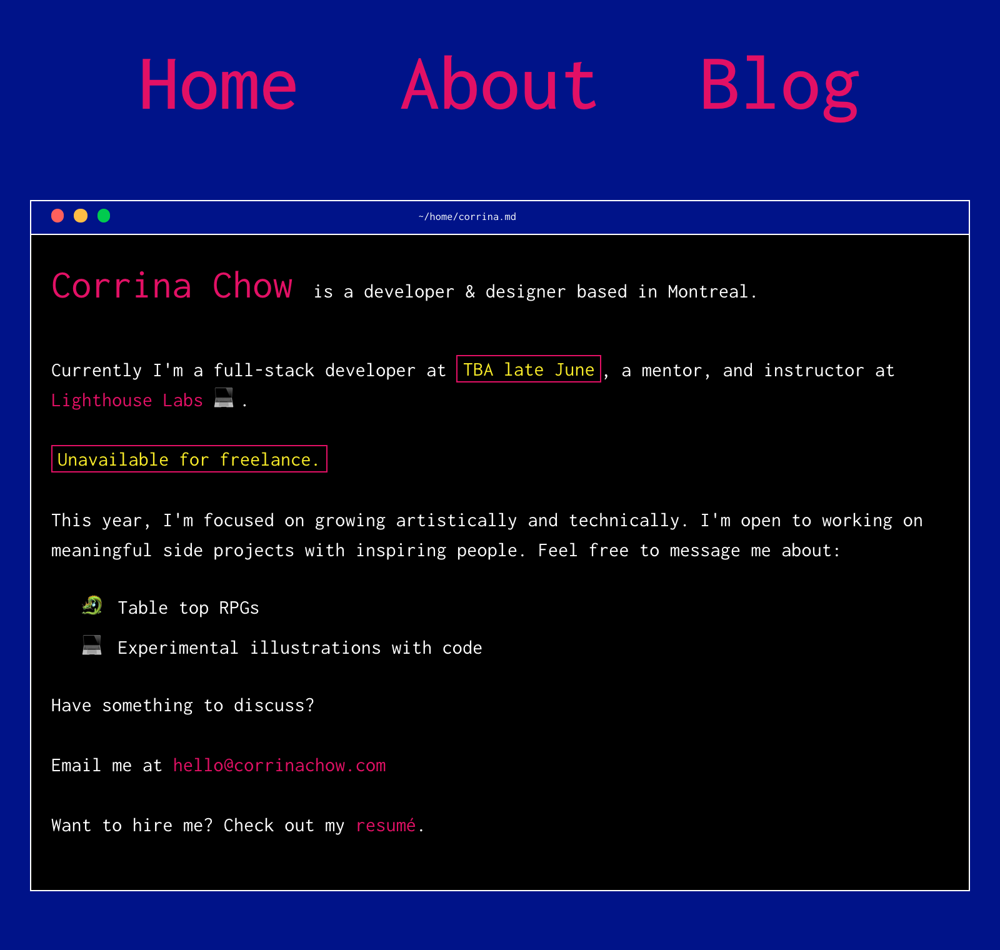
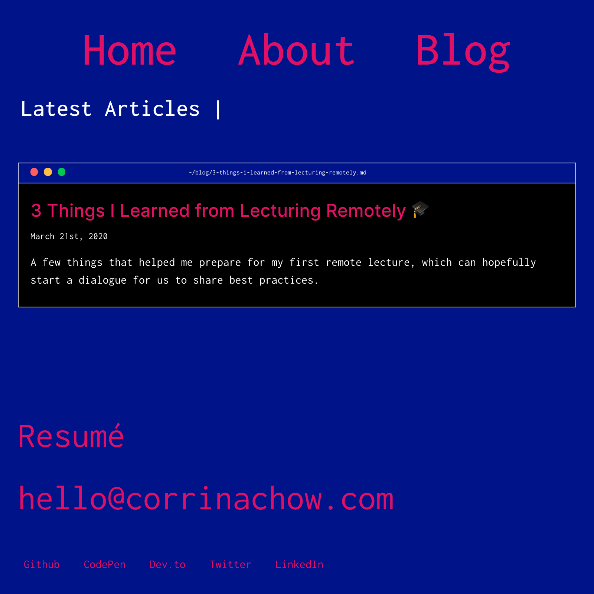
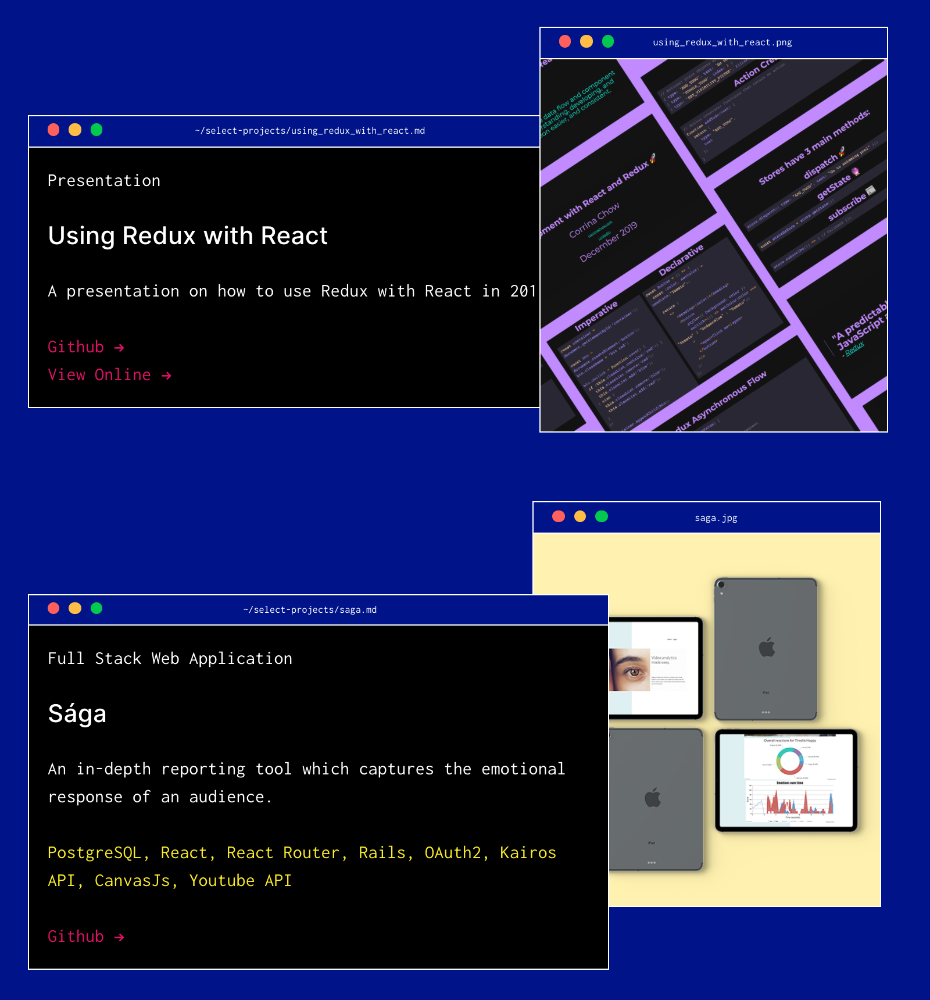

# corrinachow.com - V2

Personal website remake using Gatsby 2.0 & Contenful CMS 🚀

## Why and New Features in 2.0

My first interation of my website was a SPA made using Gatsby 1.0 and all assets stored in the repository and was made with 3 months of programming knowledge. Both of these reasons called for a major refactor.

Other features I wanted and are included in this version:

- a blog
- redesign
- a CMS for copy, projects, blog posts, site settings
- pages

### Blog

### Overlayed windows for projects

## Features To Be Added

- Themable via config in CMS (namely dark/light theme)
- Case studies for projects
- Tags for blog and related articles
